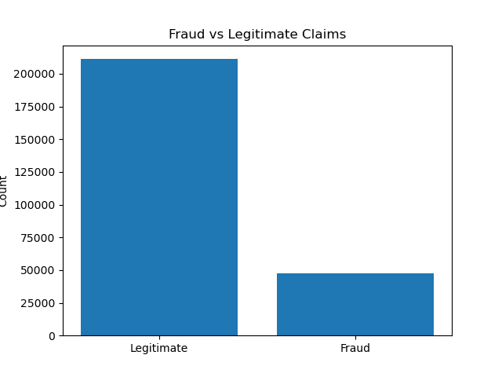
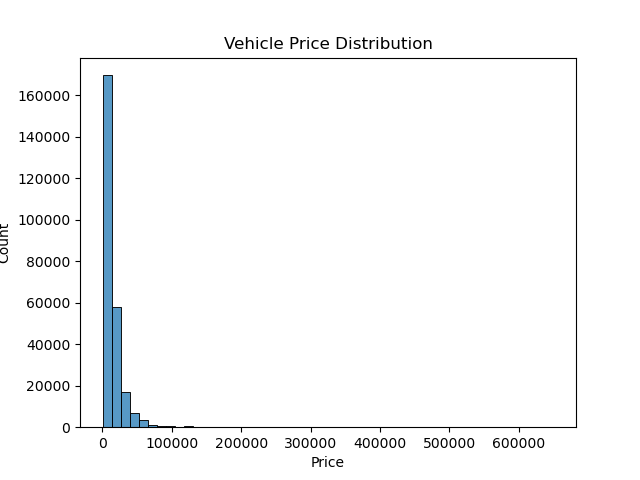
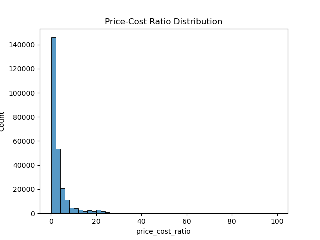
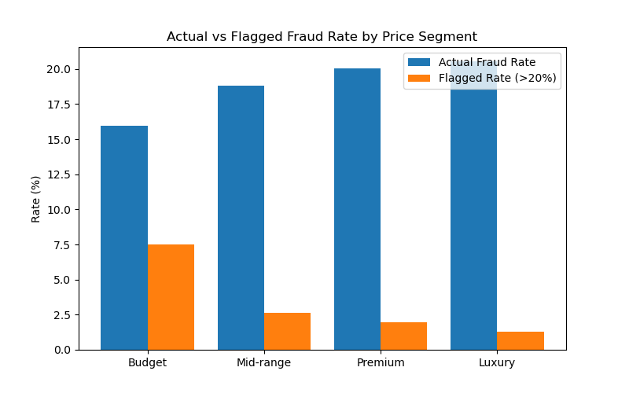
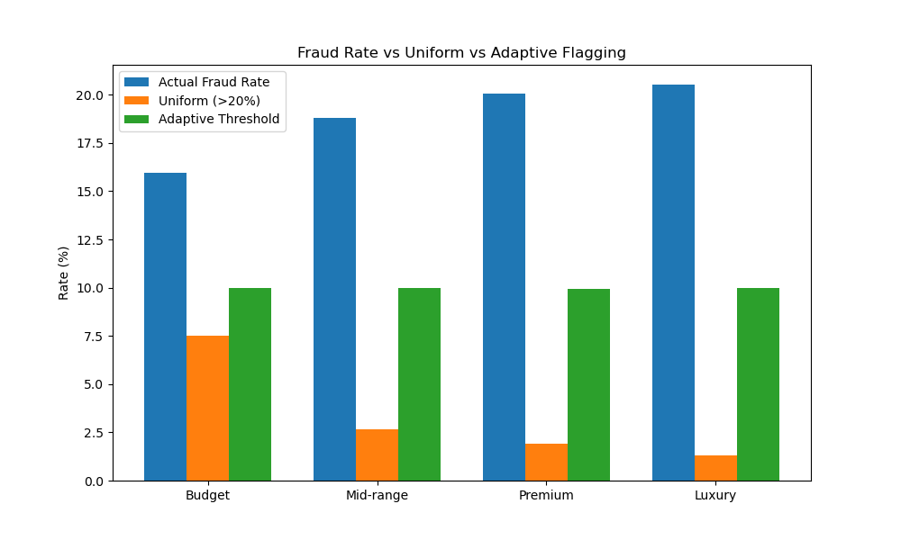

##  Motivation:

Insurance fraud costs the UK industry over **£1.1 billion annually**, increasing premiums and financial losses across the system. Detecting fraudulent claims efficiently is therefore a critical task for insurers.

Traditional fraud detection systems often rely on simple rule-based approaches, such as fixed thresholds on repair costs relative to vehicle value. While easy to implement, these methods can overlook complex fraud patterns and may unintentionally introduce bias into decision-making.

This project is motivated by the need to move beyond basic rule-based systems and develop a **data-driven approach to fraud detection** that is both **effective and fair**, ensuring that detection strategies do not disproportionately impact specific groups of customers.

## Objective:

The primary objective of this project is to develop a data-driven framework for detecting fraudulent insurance claims while critically evaluating the fairness of commonly used detection methods.

Specifically, the project aims to analyse key claim characteristics to identify patterns associated with fraudulent behaviour, and to assess whether standard rule-based approaches—such as fixed thresholds on repair cost relative to vehicle value—produce consistent and equitable outcomes across different vehicle segments.

In addition, the project seeks to design and evaluate an improved detection strategy that maintains fraud detection effectiveness while reducing potential bias, ensuring that decision-making is both accurate and fair in a real-world context.

## System Pipeline:

The project follows a structured data science pipeline, transforming raw insurance claim data into actionable insights for fraud detection and fairness evaluation.

---

### 1. Data Collection

The dataset contained several data quality issues that could negatively impact analysis, including impossible values and extreme outliers. Negative values were observed in key variables such as vehicle price, mileage, repair cost, and repair hours, which are not meaningful in a real-world context. In addition, extreme values such as vehicles with unrealistically high mileage or repair durations indicated potential data entry errors.

To address this, domain-informed thresholds were applied. Vehicle prices were restricted to a realistic range (£100 to £1M), mileage was capped at 500,000 miles, repair costs were limited to £50,000, and repair hours were constrained to a maximum of 500 hours. Invalid registration years and incorrect calendar values were also removed.

These cleaning steps retained approximately 97% of the dataset while ensuring that the remaining data accurately reflects realistic insurance claim scenarios, allowing meaningful patterns—particularly those related to fraud—to be analysed without distortion.

---

### 2. Data Cleaning

To ensure data quality and reliability, invalid and unrealistic values were removed, including negative prices, extreme repair costs, and inconsistent date entries. This step retained approximately 97% of the original data while eliminating anomalies that could distort analysis and modelling results.

---

### 3. Expolatary Data analysis 
#### Exploratory Visualisations

The following visualisations highlight key patterns identified during exploratory analysis:

**Fraud vs Legitimate Claims Distribution**
This chart shows the class imbalance in the dataset, with fraudulent claims representing approximately 18% of total observations.

---

**Vehicle Price Distribution**
Vehicle prices exhibit a strong right-skewed distribution, with a majority of claims concentrated in lower price ranges and a long tail of high-value vehicles.

---

**Price-to-Cost Ratio Distribution**
The repair cost relative to vehicle value shows significant variation, supporting its use as a key fraud indicator.

---

### 4. Feature Engineering

New variables were created to capture meaningful fraud signals. The most important of these is the **price-to-cost ratio**, which measures repair cost relative to vehicle value and serves as a key indicator of potential fraud. Additional features such as cost per repair hour and repair delay were also derived to capture labour and timing-related anomalies.
These 3 new features have been engineered which aligns with insurance fraud literature identifying cost manipulation, phantom repairs, and claim timing as primary fraud mechanisms,

**cost_per_hour** - 'repair_cost' / 'repair_hours', inflated labour rates beyond market norms are one of fraud mechanisms, UK garage rates typically range £30-£150/hour, with specialist rates up to £200-£300/hour. So it was  filtered to a reasonable £500/hour.

**price_to_cost_ratio** - 'repair_cost' / 'Price', Exaggerating repair costs relative to vehicle value. Insurance industry practice deems vehicles "economic write-offs" when repair costs exceed 60-70% of 
market value [1].  So it was  filtered to a reasonable 100%.

**repair_lag_days** - 'repair_date' - 'breakdown_date', to detect pre-arranged repairs and claim manipulation.

---

### 5. Bias Detection:
####  Bias Analysis

To evaluate the fairness of standard fraud detection rules, a commonly used industry approach was applied, where claims are flagged as potentially fraudulent if the repair cost exceeds **20% of the vehicle’s value**.

---

#### Segmentation Approach:

To assess whether this rule behaves consistently across different types of vehicles, the dataset was segmented into four price categories:

* **Budget (£0–5k)**
* **Mid-range (£5k–15k)**
* **Premium (£15k–30k)**
* **Luxury (£30k+)**

This segmentation allows for comparison of both actual fraud rates and rule-based flagging rates across economically distinct groups.

---

#### Observed Patterns:

Analysis revealed a clear mismatch between actual fraud occurrence and rule-based flagging:

* Budget vehicles exhibited **significantly higher price-to-cost ratios**, often due to lower vehicle values rather than genuinely inflated repair costs
* Luxury vehicles showed **lower ratios**, despite having higher absolute repair costs

As a result:

* **Budget vehicles were flagged at a much higher rate (~7.5%)**
* **Luxury vehicles were flagged at a significantly lower rate (~1.3%)**

However, the actual fraud rates showed the opposite trend:

* Budget vehicles: **~16% fraud rate**
* Luxury vehicles: **~20% fraud rate**

This indicates that the rule disproportionately targets lower-value vehicles while under-detecting fraud in higher-value segments.

---

#### Visual Evidence:

The disparity between actual fraud rates and flagged claims across segments is illustrated below:

---

#### Statistical Validation:

To confirm that these differences are not due to random variation, statistical tests were applied:

* The **Kruskal-Wallis test** confirmed that the distribution of the price-to-cost ratio differs significantly across price segments
* The **Chi-square test** showed that the distribution of flagged claims is not independent of vehicle segment

Both tests returned **statistically significant results (p < 0.001)**, providing strong evidence that the observed disparities are systematic rather than incidental.

---

#### Key Insight

The use of a **uniform threshold** for fraud detection introduces a clear form of socioeconomic bias:

* Lower-value vehicles are disproportionately flagged
* Higher-value vehicles are under-flagged relative to their actual fraud rates

This highlights a critical limitation of rule-based systems, where ignoring underlying data distributions can lead to unfair and inefficient outcomes.

---

#### Implication

These findings demonstrate that fraud detection systems must be designed with awareness of underlying data characteristics. Applying a single global threshold across heterogeneous groups can lead to biased decision-making, reinforcing the need for more adaptive and data-driven approaches.

---

### 6. Adaptive Threshold Design:

#### Adaptive Threshold Approach:

To address the bias identified in the standard rule-based system, a data-driven approach was developed to ensure that fraud detection remains both effective and fair across different vehicle segments.

---

#### Rationale:

The bias observed in the previous analysis arises from the use of a **single global threshold**, which does not account for differences in data distribution across vehicle categories.

Since lower-value vehicles naturally exhibit higher repair cost ratios, applying a fixed threshold disproportionately flags these vehicles, while higher-value vehicles are underrepresented in flagged cases.

To overcome this limitation, the detection rule must adapt to the **underlying distribution within each segment**, rather than applying a uniform standard.

---

#### Methodology:

A segment-specific threshold was calculated for each vehicle category using the **90th percentile of the price-to-cost ratio** within that segment.

This approach ensures that:

* Each segment is evaluated relative to its own distribution
* Extreme values within each group are identified consistently
* The threshold reflects realistic variation in repair costs

The resulting thresholds differ across segments, allowing the model to account for structural differences in the data.

---

#### Results:

Applying the adaptive threshold approach produced a significantly more balanced outcome:

* Flagging rates across all segments converged to approximately **~10%**
* The disparity observed under the uniform rule was effectively removed
* Fraud detection performance remained stable

---

#### Visual Comparison:

The improvement in fairness can be observed by comparing uniform and adaptive approaches:

---

#### Statistical Validation:

To verify the effectiveness of the adaptive approach, the Chi-square test was applied again:

* Under the uniform threshold → **statistically significant differences (p < 0.001)**
* Under the adaptive threshold → **no statistically significant difference**

This confirms that the adaptive method successfully eliminates the dependency between vehicle segment and fraud flagging, indicating a fairer system.

---

#### Key Insight: 

A **data-driven, segment-specific approach** can eliminate bias without compromising fraud detection capability.

This demonstrates that fairness in decision systems is not achieved by removing rules, but by designing them to reflect **real data distributions**.

---

#### Implication:

The results highlight the importance of moving beyond static rule-based systems towards **adaptive and context-aware models**.

In real-world applications, such approaches can:

* Improve trust in automated decision systems
* Reduce unfair targeting of specific groups
* Maintain operational efficiency in fraud detection

This reinforces the need for fairness-aware design as a core component of modern data science solutions.

---

### 7. Final Pipeline

The effectiveness of the adaptive approach was evaluated by comparing it with the standard rule. Results show that the new method maintains fraud detection performance while eliminating statistically significant disparities in flagging rates across segments.

### 8. Current Challenges

While the proposed approach improves fairness and detection quality, several challenges remain:

* **Class Imbalance**
  Fraudulent claims represent a relatively small proportion of the dataset (~18%), making it difficult to balance detection performance with false positives.

* **Threshold Sensitivity**
  The adaptive approach relies on percentile-based thresholds, which may be sensitive to changes in data distribution over time and may require periodic recalibration.

* **Trade-off Between Fairness and Detection**
  Improving fairness across segments can sometimes reduce sensitivity to certain types of fraud, highlighting the need to carefully balance equity and effectiveness.

* **Limited Feature Scope**
  The analysis is primarily based on structured claim data. Additional contextual information (e.g. customer behaviour, historical claims) could further improve detection accuracy.

* **Static Rule-Based Approach**
  Although adaptive, the system still relies on rule-based thresholds rather than fully dynamic machine learning models, which may limit its ability to capture more complex fraud patterns.
